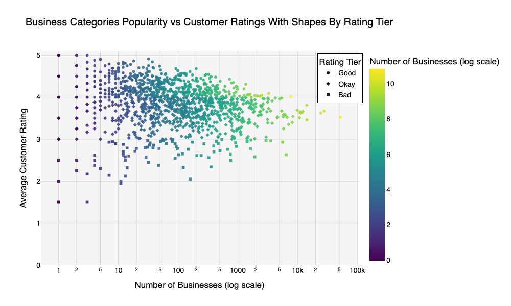
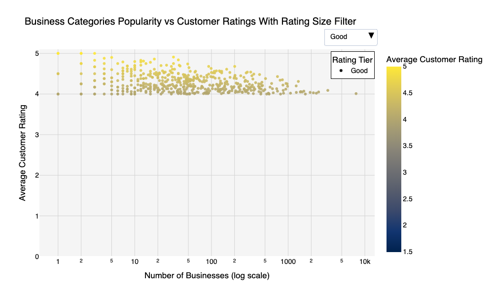

## Business Category Popularity vs. Customer Ratings

## Overview
This project explores how business category popularity relates to customer ratings, driven by my interest in both data visualization and how businesses are perceived by customers. I was especially drawn to how visualization design can influence interpretation, so rather than just analyzing the data, I focused on experimenting with visual encodings to understand how design choices shape which business insights stand out.

## Research Question
**What factors are associated with higher customer ratings for businesses, and how does category popularity influence perceived quality?**

## What This Project Does
Using a business review dataset, the notebook:

- Analyzes the relationship between **business category popularity** and **average customer ratings**
- Uses multiple visualization strategies to surface patterns and comparisons
- Applies different **encoding techniques** (color, symbols, filtering) to improve clarity and interpretability
- Evaluates how visualization choices can emphasize or obscure trends

## Visualizations & Analysis

### Category Popularity vs. Customer Ratings

This visualization shows the core relationship:  
**x-axis = category popularity (number of businesses)** and  
**y-axis = average customer rating**.  

It highlights how most highly popular categories cluster around mid-to-high ratings rather than extreme highs or lows.

### Highlighting Rating Quality with Shape

Here, rating tiers (**Good, Okay, Bad**) are encoded using different shapes.  
This makes it easier to compare how **rating quality changes as categories become more or less popular**, without relying only on color.

### Filtering to Reduce Visual Overload

This version adds filtering to focus on subsets of categories, helping separate dense regions of the plot.  
It shows how filtering can make popularity-driven patterns clearer while still preserving overall context.

## Key Takeaways
- Category popularity and customer ratings are related, but not in a simple linear way  
- Extremely popular categories tend to converge toward “good but not perfect” ratings  
- Less popular categories show much wider rating variability  
- Visualization design choices (scale, color, shape, filtering) strongly affect how these patterns are perceived  
- Thoughtful visual encoding is just as important as the underlying analysis
